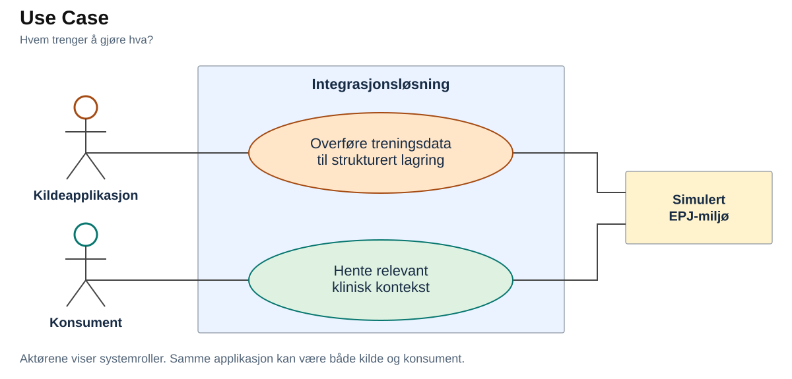
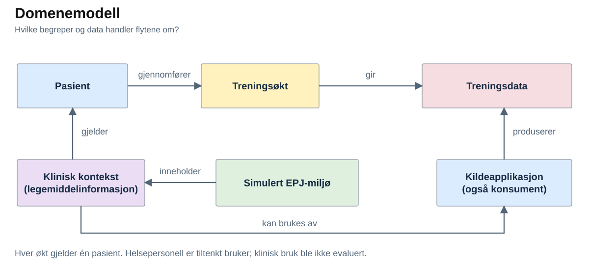
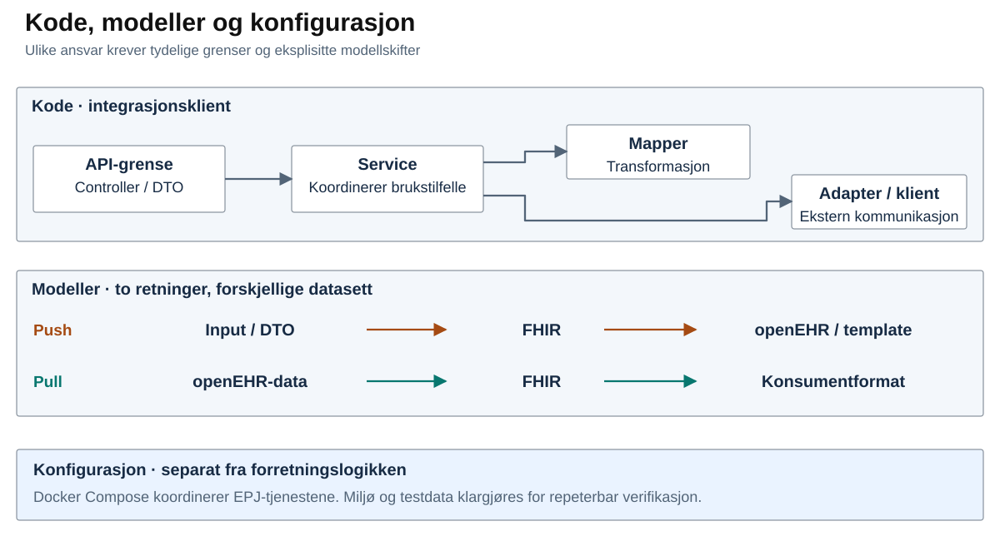

# NVE – Casepresentasjon

**2. gangsintervju · Usman Ghafoorzai**

## Case 1 – Strukturert datautveksling i to retninger

Jeg tar utgangspunkt i **én interoperabilitetsløsning med to komplementære dataflyter** fra bachelorprosjektet: treningsdata inn til strukturert lagring og klinisk kontekst ut til konsumenten.

Vi var to studenter med felles ansvar for framdrift og kvalitet, og arbeidsformen var lagt opp slik at begge bidro til teknisk utvikling, dokumentasjon og kvalitetssikring gjennom prosjektet. Jeg arbeidet på tvers av analyse, design, implementasjon, testing/verifikasjon og rapportering.

> **Ramme:** Lokal PoC, simulert EPJ-miljø og syntetiske data. Produksjonsklar autentisering og autorisasjon, samt full synkroniserings- og konflikthåndtering, inngikk ikke i den implementerte PoC-en. Produksjonsintegrasjon og klinisk validering inngikk ikke.

### Problem, formål og verdi

Treningsdata og klinisk kontekst finnes i forskjellige systemer og representasjoner. Pasienttilknytning, struktur, tidspunkt og betydning må bevares slik at mottakeren kan bruke informasjonen. Formålet var å demonstrere strukturert utveksling i begge retninger.

- **Demonstrert verdi:** Redusert teknisk usikkerhet ved å vise at data kunne valideres, transformeres, lagres, hentes og verifiseres.
- **Potensiell virksomhetsverdi:** Informasjon fra separate systemer kan bli tilgjengelig der den trengs. Mindre manuell innhenting og overføring er mulige gevinster, ikke målte kliniske, økonomiske eller produksjonsmessige effekter.

### Use Case – hvem trenger å gjøre hva?

Kilden sender treningsdata til strukturert lagring. Konsumenten henter klinisk kontekst gjennom integrasjonsløsningen og det simulerte EPJ-miljøet.

### Domene – hva betyr dataene?

Handlingene gjelder en pasient, treningsøkter og klinisk kontekst. **Pull hentet legemiddelinformasjon, ikke treningsdataene fra push.**

Nå har vi sett hva slags data vi snakker, neste steg er hvordan vi løste det teknisk. 

### Implementert løsning og teknologier

| Komponent / rolle | Teknologi og ansvar |
|---|---|
| Integrasjonsklient | **NestJS / TypeScript:** API-/DTO-grense, koordinering og tilpasning til konsumentformat. |
| Utveksling | **FHIR:** utvekslingsrepresentasjon. **HAPI FHIR:** ressurslagring og Subscription for push. |
| Bridge- og mappinglag | **Java / Spring:** transformasjon, EHR-oppslag og koordinering av lagring/uthenting. |
| Klinisk representasjon | **openEHR og template:** avgrenser forventet klinisk struktur for persistens. |
| Repository og persistens | **EHRbase:** openEHR-tjeneste. **PostgreSQL:** underliggende lagring for EHRbase og HAPI FHIR. |

Push brukte HAPI FHIR før bridge-laget. Pull brukte en separat uthentingsvei mellom integrasjonsklienten og bridge-laget. Applikasjonslogikken brukte tjenestegrensesnitt; PostgreSQL var underliggende persistens.

### Push – fra treningsdata til persistens

En syntetisk pasient var opprettet før innsending. Klienten validerte input, koordinerte flyten og mappet treningsdata til FHIR før videresending. HAPI FHIR lagret ressursen, og en konfigurert Subscription videresendte relevante nye ressurser til bridge-laget.

Bridge-laget fordelte mottaket til riktig behandling, hentet ut innholdet og bygde en openEHR composition mot forventet template-struktur. Riktig EHR ble funnet eller opprettet for den syntetiske pasienten før lagring gjennom EHRbase. Vi kontrollerte FHIR-resultatet og faktisk persistens separat fra kvitteringen ved inngangen.

### Pull – fra klinisk kontekst til konsument

Konsumenten ba om oppdateringer for en pasient og et tidspunkt. Klienten validerte forespørselen; bridge-laget koordinerte EHR-oppslag og tidsfiltrert uthenting med **AQL** fra EHRbase.

Resultatet ble parset og mappet fra openEHR-data til en FHIR-basert representasjon. Klienten mappet videre til konsumentformat og returnerte data eller tom liste. Vi verifiserte utvalg, tidsfilter og respons. Konsumenten styrte når den spurte; klienten hadde ingen egen periodisk polling.

**Forskjellen:** Push startet med nye data og endte i strukturert persistens. Pull startet med konsumentbehov og endte i en filtrert respons. Hendelsesdrevet videresending og forespørselsstyrt uthenting krevde ulike mekanismer.

### Hvordan vi organiserte løsningen

#### Kode

Integrasjonsklientens **controller/DTO** håndterte API-grensen, **service** koordinerte brukstilfellet, **mapper** transformerte data og **adapter/client** håndterte ekstern kommunikasjon. Det skilte ansvar, begrenset kobling til transportdetaljer og gjorde endringer og testing enklere.

Bridge-laget hadde separat push- og pull-logikk for mapping og uthenting, med delt EHRbase-kommunikasjon der ansvaret var felles.

#### Modeller

**DTO** definerte forventet API-struktur, **FHIR** representerte informasjon under utveksling, og **openEHR/template** avgrenset den kliniske strukturen ved persistens. **Konsumentformatet** ga mottakeren det utvalget den trengte. Ulike ansvar krevde ulike modeller og eksplisitt mapping mellom dem.

#### Konfigurasjon

**Docker Compose** koordinerte det lokale EPJ-miljøet med separate database-, FHIR-, bridge- og EHR-tjenester. Miljøkonfigurasjon var skilt fra forretningslogikken. Miljøet kunne startes og resettes med klargjorte testdata for repeterbar verifikasjon.

Når data krysser disse grensene, må både struktur og betydning kontrolleres gjennom representasjonsskiftene.

### Datakvalitet gjennom flyten

- **API → FHIR:** DTO-validering kontrollerte input. Enhetstester med **Jest** kontrollerte mapping og logikk; API-kontroller undersøkte FHIR-resultatet.
- **FHIR → openEHR:** openEHR-templaten definerte forventet målstruktur. Tester av mappinglogikken og inspeksjon i **EHRbase** verifiserte transformasjonen og den faktiske persistensen. En template alene garanterer ikke datakvalitet eller klinisk riktighet.
- **openEHR → konsument:** AQL-verifikasjon, lokale E2E-tester og API-kontroller undersøkte uthenting, transformasjon, tidsfiltrering og tom respons. **Swagger/OpenAPI** støttet dokumentasjon og manuell kontroll.

Identifikatorer, responser og lagret/hentet innhold gjorde testdataene sporbare. **200 OK ved inngangen betyr ikke at hele dataflyten er korrekt.** Kontrollene gjaldt utvalgte tekniske scenarioer med syntetiske data.

### Ansvar, dataopprinnelse og kontrakter

Kildeapplikasjonen produserte treningsdataene; EPJ-miljøet var kilden til klinisk kontekst. Integrasjonsklienten validerte, transformerte og formidlet. Den var ingen autoritativ klinisk datakilde eller permanent klinisk lagring.

Vi hadde tydelige komponentansvar og tekniske grensesnittkontrakter gjennom **DTO/API-, FHIR- og openEHR-grensene**. Formaliserte datakontrakter, dataeierskap, SLA-er og driftsansvar var ikke etablert som i et produksjonsdataprodukt. I produksjon ville jeg formalisert eiere, versjonering, kvalitetskrav og ansvar ved feil og endringer.

### Største utfordring og designvalg

**Problem:** Den opprinnelige arkitekturen la opp til HAPI FHIR i begge retninger. Det fungerte for hendelsesdrevet push, men Subscription-mekanismen løste ikke behovet for forespørselsstyrt uthenting i pull.

**Alternativ:** Endre FHIR-serverens interne oppførsel. Det ville økt kompleksiteten og omfanget.

**Beslutning:** Beholde Subscription for push og bruke en separat forespørselsstyrt uthentingsvei for pull.

**Trade-off:** Begge retninger kunne implementeres og verifiseres, men pull var ikke et fullt standardkompatibelt FHIR-søk. Standardisert søk og validering fulgte ikke automatisk med denne veien.

**Læring:** En felles representasjon betyr ikke at samme transportmekanisme dekker alle behov. Begge retninger må prøves før arkitekturen låses.

### Utviklingsflyt og CI/CD

**Avgrenset endring → PR → automatiserte tester og byggkontroller → merge/integrasjon.** GitHub Actions støttet dette. Full Docker-E2E lå utenfor standard CI, så vi supplerte med lokal verifikasjon gjennom flytene. Dette var ingen automatisert produksjonsleveranse.

### Resultat, læring og videre arbeid

Den lokale PoC-en verifiserte strukturert push og selektiv pull med syntetiske data. Resultatet viste teknisk gjennomførbarhet, ikke klinisk effekt.

Jeg lærte å forstå dataenes betydning, plassere ansvar ved systemgrenser og behandle mapping som en sentral engineering-oppgave. **Verifiser det konsumenten faktisk får, og det som faktisk blir lagret.**

Videre ville jeg prioritert bedre standardtilpasning av pull, automatisert E2E, kvalitetskrav og observability. Tilgangskontroll, domenevalidering og testing i et produksjonsnært miljø måtte også på plass.

---

## Case 2 – Etter 2–3 år som dataingeniør i NVE

Hvis vi spoler 2–3 år fram, håper jeg å ha blitt sterkere faglig, fått mer ansvar og blitt en ordentlig del av miljøet i NVE.

### Dette tar jeg med inn

Jeg har software- og integrasjonsbakgrunn med Java, TypeScript, SQL/databaser, API-er og testing. Jeg er vant til å følge data gjennom systemer og feilsøke, men har mye å lære om dataplattform, datamodellering og drift.

### Første tid – lære NVE og bli en del av teamet

Jeg ser for meg å lære dataene, domenet og [plattformen](https://www.nve.no/om-nve/jobb-i-nve/bli-en-del-av-nves-satsing-paa-data-plattform-og-gis/) gjennom avgrensede oppgaver med erfarne kolleger. Jeg bygger videre på SQL og Python og lærer dbt, Azure, Databricks og Airflow i praksis.

Samtidig vil jeg bli kjent med folk, tørre å spørre når jeg ikke vet og ta imot tilbakemeldinger. Jeg vil delta både faglig og sosialt.

### Etter hvert – mer ansvar

Etter hvert håper jeg å kunne følge større deler av en dataflyt helt fram til dem som trenger dataene. Erfaringen med integrasjoner og feilsøking gir meg noe å bygge videre på.

### Etter 2–3 år – tryggere og en del av miljøet

Jeg håper å kunne ta større oppgaver fra behov til løsning og drift, gjøre egne vurderinger og vite når jeg trenger hjelp.

Jeg håper også å kjenne kollegene godt, delta på sosiale ting og bidra til at det er hyggelig å komme på jobb. Da vil jeg gjerne hjelpe nye kolleger inn i miljøet, og være en folk både jobber godt med og trives sammen med.

[NVEs arbeid](https://www.nve.no/om-nve/dette-er-nve/) med energi, vassdrag og naturfare gir dette mening. Jeg vil bidra til data andre kan stole på.
