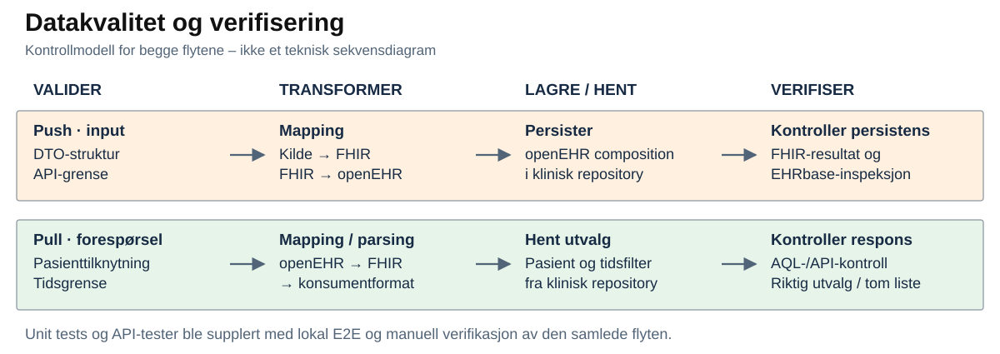

# NVE Case 1 – Strukturert datautveksling i to retninger

Casebesvarelse av **Usman Ghafoorzai**

Jeg tar utgangspunkt i **én interoperabilitetsløsning** vi utviklet i bachelorprosjektet, med **to komplementære dataflyter**: treningsdata inn til strukturert lagring og klinisk kontekst tilbake til konsumenten.

Vi var to studenter som begge deltok gjennom hele prosjektløpet, fra behovsforståelse, forprosjekt og krav til modellering, arkitektur, implementasjon, testing og rapportering. Konkrete oppgaver ble fordelt underveis, og jeg arbeidet på tvers av analyse, design, implementasjon, verifikasjon og dokumentasjon.

> **Ramme:** Lokal Proof of Concept (PoC), simulert EPJ-miljø og syntetiske data. Produksjonsintegrasjon, klinisk validering og en ferdig brukerflate inngikk ikke.

## Tilnærming

**Behov og aktører → handlinger → begreper og data → informasjonsflyt → krav → teknisk realisering → verifikasjon → ansvar og læring**

Prosjektet ble utviklet iterativt. Domene, krav, arkitektur og tester ble justert etter hvert som vi avklarte behov og tekniske begrensninger.

## Spørsmål som styrte arbeidet

- **Hva måtte utveksles?** Treningsdata inn og utvalgt klinisk kontekst tilbake.
- **Hvordan bevares betydningen?** Pasienttilknytning og innhold må henge sammen gjennom modellskiftene.
- **Hvem initierer og har ansvar?** Push og pull starter hos ulike roller og stiller ulike krav.
- **Hvor mye må systemene kjenne til hverandre?** Integrasjonsgrensen tilpasser data uten å eksponere hele lagringsmodellen.
- **Hva viser at flyten virker?** Både lagret innhold og returnert utvalg må kontrolleres.

## 1. Problem og behov

Treningsresultater kan være relevante for klinisk oppfølging, mens en ekstern applikasjon kan trenge klinisk kontekst. Informasjonen må utveksles mellom ulike modeller i en form mottakeren kan bruke.

- **Demonstrert verdi:** Redusert teknisk usikkerhet ved å verifisere strukturert utveksling i begge retninger, med etterprøvbar transformasjon, lagring og uthenting.
- **Potensiell virksomhetsverdi:** Gjøre treningsresultater tilgjengelige i klinisk kontekst og klinisk kontekst tilgjengelig for en ekstern applikasjon. Mindre manuell innhenting og overføring er mulige gevinster, ikke målte effekter.

Kildeapplikasjonen sender treningsdata; konsumenten ber om kontekst. Samme applikasjon kan ha begge roller, men handlingene er forskjellige.

### Use Case

Handlingene avklarer hva aktørene trenger før teknologien velges: overføre treningsdata til strukturert lagring og hente relevant klinisk kontekst.

Handlingene forutsetter et felles begrepsgrunnlag: hva er en økt, hvem gjelder dataene, og hvilken kontekst trenger konsumenten?

## 2. Domene og data

Hver økt tilhører én pasient i testscenarioet. Pull var avgrenset til **legemiddelinformasjon**, opprettet som syntetiske testdata i EPJ-miljøet. Dette var et annet datasett enn treningsdataene.

**Modelleringspoeng:** Pasienttilknytning, tidspunkt og betydning må følge informasjonen gjennom representasjonene.

Begrepene avklarer hva informasjonen gjelder. For å avgrense utvekslingen må vi også skille mellom hvor den oppstår og hvor den skal brukes.

## 3. Informasjonsflyt

Informasjonsflyten knytter dataene til systemgrensene før transport og tekniske representasjoner velges.

**Push** fører treningsdata fra kilden til EPJ-miljøet. **Pull** fører etterspurt legemiddelkontekst til konsumenten gjennom samme integrasjonsgrense. Det er ikke push-datasettet i motsatt retning. Ulike behov gir ulike krav til lagring, utvalg og respons.

## 4. Krav til dataflytene

| Behov | Krav som styrte implementasjonen |
|---|---|
| Data inn | Validere input, transformere og lagre treningsdata strukturert. |
| Kontekst ut | Hente for valgt pasient, filtrere på oppdateringstid og håndtere ingen nye data. |
| Etterprøvbarhet | Kunne kontrollere respons, mapping og lagrede/hentede data. |
| Testbarhet | Modulære komponenter, dokumenterte API-er og et repeterbart lokalt miljø. |

**Avgrensning:** Autentisering, autorisasjon og komplett synkronisering var utenfor den implementerte PoC-en.

Arkitekturen må fordele oppgavene kravene gir: kontrollere input, skifte representasjon og lagre eller hente data.

## 5. Arkitektur og teknologier

| Rolle | Teknologi og bruk i PoC-en |
|---|---|
| Integrasjonsgrense | **NestJS / TypeScript:** inputvalidering, koordinering og konsumentformat. |
| Utveksling | **HL7 FHIR:** utvekslingsrepresentasjon. **HAPI FHIR:** server og Subscription i push. |
| Mapping og uthenting | **Java / Spring:** transformasjon mellom FHIR og openEHR; koordinering av pull. |
| Klinisk representasjon og lagring | **openEHR:** klinisk informasjonsmodell. **EHRbase:** repository. **PostgreSQL:** underliggende persistent lagring for EPJ-tjenestene. |
| Kjøring og verifikasjon | **Docker Compose**, **Jest**, **GitHub Actions**, **Swagger/OpenAPI** og **AQL**. |

FHIR ble brukt som utvekslingsrepresentasjon; openEHR ga den strukturerte kliniske representasjonen for persistens i EHRbase. Lagring og uthenting gikk gjennom tjenestegrensesnitt. Docker Compose samordnet testmiljøet, mens forespørsler og hendelser drev flytene.

Komponentansvaret må følges gjennom hver flyt, fra trigger til sluttresultat.

## 6. Implementerte dataflyter

### 6.1 Push – fra kildedata til strukturert lagring

1. **Kilden sender:** En syntetisk pasient opprettes først. Treningsdata sendes med pasienttilknytning gjennom integrasjonsgrensen.
2. **Grensen validerer og transformerer:** Input kontrolleres mot forventet struktur og representeres som en FHIR Observation.
3. **Utvekslingslaget videresender:** FHIR-serveren lagrer ressursen. Subscription varsler mappinglaget om relevante nye data.
4. **Mappinglaget strukturerer:** Informasjonen omformes til en openEHR composition og lagres i det kliniske repositoryet.

**Verifikasjon:** Vi kontrollerte både FHIR-representasjonen og det faktisk lagrede openEHR-innholdet. Kvitteringen fra første API-kall var ikke alene bevis på at hele den hendelsesdrevne kjeden var fullført.

Pull starter med et annet behov: konsumenten ber om klinisk kontekst som allerede finnes i EPJ-miljøet.

### 6.2 Pull – fra klinisk kontekst til konsument

1. **Konsumenten spør:** Forespørselen angir pasient og sist kjente oppdateringstid. Integrasjonsgrensen validerer forespørselen.
2. **Uthentingslaget finner data:** Pasienten knyttes til riktig journal i testmiljøet. AQL brukes til å hente strukturert legemiddelkontekst med tidsfiltrering.
3. **To representasjonsskifter:** openEHR-data omformes til en FHIR-basert representasjon, deretter til et enklere konsumentformat.
4. **Grensen returnerer:** Relevante oppdateringer kommer tilbake; uten nyere data returneres en tom liste.

**Verifikasjon:** Vi kontrollerte uthenting fra repositoryet, transformert respons og oppførsel med ulike tidsgrenser. Konsumentsiden hadde ansvar for når den spurte; integrasjonsgrensen hadde ingen egen periodisk polling eller varig lagring av pasientkoblinger.

### 6.3 Hvorfor flytene er forskjellige

| | Push | Pull |
|---|---|---|
| Trigger og ansvar | Kilden har en ny økt og sender. | Konsumenten trenger kontekst og spør. |
| Dataretning | Treningsdata → klinisk lagring. | Klinisk kontekst → konsument. |
| Transformasjon | Kildeformat → FHIR → openEHR. | openEHR → FHIR → konsumentformat. |
| Mekanisme | Innsending, deretter Subscription. | Eksplisitt request/response og filtrert uthenting. |
| Kontrollpunkt | Riktig struktur faktisk persistert. | Riktig utvalg og respons, også uten nye data. |

Subscription reagerte på ressursendringer, ikke GET-forespørsler. Pull fikk derfor en egen uthentingsvei, med et arkitekturavvik som utdypes i del 9.

Representasjonsskiftene krever kontroll av både innholdet underveis og sluttresultatet.

## 7. Datakvalitet og verifisering

**Lagring** persisterer data; **EHRbase-inspeksjon** kontrollerer persistensen. For pull kontrolleres uthentingen og det returnerte utvalget.

**Kvalitet ble kontrollert på flere nivåer:**

- **Input og struktur:** DTO-validering og tester av API-grensen, inkludert controller- og klientoppførsel.
- **Transformasjon:** Unit tests av mapping, parsing og tjenestelogikk. Kontrollen gjaldt også hvordan data ble representert etter modellskiftet.
- **Push gjennom systemet:** Lokale E2E-tester kontrollerte utvalgt API-oppførsel og FHIR-resultat. Separat inspeksjon i EHRbase bekreftet strukturert persistens.
- **Pull gjennom systemet:** AQL-verifikasjon av syntetisk kontekst, lokale E2E-tester og manuelle API-kontroller av uthenting, tidsfiltrering og respons.

**Sporbarhet:** Identifikatorer, API-responser og lagret/hentet innhold lot oss følge testdata gjennom kjeden. Verifikasjonen gjaldt utvalgte tekniske scenarioer.

Der én komponents leveranse blir en annens input, må ansvar og kontrakter være tydelige.

## 8. Ansvar, eierskap og kontrakter

Som informasjonsflyten viser, produserte kildeapplikasjonen treningsdataene, mens EPJ-miljøet var kilden til den kliniske konteksten. Integrasjonsgrensen validerte, transformerte og formidlet informasjon; den var verken en ny autoritativ kilde eller et permanent klinisk datalager.

| Grense | Ansvar i PoC-en | Teknisk kontrakt |
|---|---|---|
| Kilde/konsument ↔ integrasjon | Validering og tilpasning ved grensen. Varig identitetskobling og tidspunkt for uthenting lå utenfor. | Dokumenterte API-/DTO-strukturer. |
| Integrasjon ↔ utveksling/mapping | Push bruker en hendelsesdrevet mekanisme; pull bruker en separat forespørselsstyrt uthentingsmekanisme. | FHIR-baserte representasjoner. |
| Mapping ↔ repository | Semantisk transformasjon, strukturert persistens og uthenting. | openEHR-strukturer og repositoryets grensesnitt. |

Dataopprinnelse og komponentansvar var avklart. **Formelt dataeierskap og driftsansvar var ikke etablert som i et produksjonsdataprodukt.** Jeg ville formalisert eiere, versjonerte kontrakter, kvalitetskrav og endrings- og feilansvar.

Ansvarsdelingen avklarte systemgrensene, men de ulike mekanismene krevde et valg mellom symmetrisk arkitektur og gjennomførbarhet.

## 9. Utfordring og designvalg

**Problem:** Ambisjonen om ett felles FHIR-lag støtte på forskjellen mellom hendelsesdrevet videresending og forespørselsstyrt uthenting.

**Alternativer:** Vi vurderte å endre FHIR-serverens interne oppførsel. Det ville økt kompleksiteten og omfanget. For push kunne vi bruke eksisterende Subscription-støtte.

**Beslutning:** Beholde den hendelsesdrevne mekanismen for push og bruke en separat forespørselsstyrt uthentingsmekanisme for pull.

**Trade-off:** Begge flyter kunne implementeres og verifiseres lokalt, men pull brukte en annen mekanisme enn push og var **ikke et fullt standardkompatibelt FHIR-søk**. Egenskaper som innebygd søk og validering fulgte derfor ikke automatisk med uthentingsveien.

**Læring:** Verifiser hver retning før arkitekturen låses. En felles representasjon betyr ikke at samme transportmekanisme dekker alle behov.

Arkitekturendringene måtte kunne innføres uten å bryte fungerende flyter. Det krevde avgrensede endringer og repeterbare kontroller.

## 10. Utviklingsflyt og CI/CD

**Avgrenset endring → Pull Request → automatiserte tester og byggkontroller → merge/integrasjon**

Kodeansvaret var delt i API-håndtering, tjenester, klienter og mapping, med tester rundt disse grensene. Arbeidsflyten ble strammet inn underveis med tydeligere endringer og CI-kontroller.

GitHub Actions kjørte tester og bygg/verifikasjon. **Full Docker-basert E2E var utenfor standard CI**, fordi testene krevde kjørende tjenester og klargjorte testdata. Derfor supplerte vi med lokal og manuell verifikasjon. Dette var CI frem mot integrasjon, ikke en automatisert produksjonsleveranse.

## 11. Resultat, læring og videre arbeid

**Resultatet:** Den lokale PoC-en verifiserte strukturert lagring av syntetiske treningsdata og selektiv uthenting av legemiddelkontekst fra simulert EPJ. Tidsfiltrering ga data eller tom respons.

Dette viste teknisk gjennomførbarhet, ikke klinisk effekt. Jeg lærte å verifisere hver retning mot sitt sluttresultat og gjøre arkitekturavvik tydelige.

Med dette som grunnlag ville jeg prioritert tre forbedringer:

1. **Standardisere pull:** Undersøke en standardtilpasset uthentingsvei gjennom et FHIR-lag, med tydelige versjonerte kontrakter.
2. **Styrke kvalitet og drift:** Automatisere et repeterbart E2E-miljø i CI, definere kvalitetskrav og forbedre overvåking og feilsporing.
3. **Validere for neste miljø:** Fullføre tilgangskontroll, få modellene vurdert av domeneeksperter og teste mot mer produksjonsnær infrastruktur.

## Avslutning

- **Forstå dataenes betydning før modellene kobles sammen.**
- **Plasser ansvar ved tydelige systemgrenser.**
- **Verifiser det konsumenten faktisk får – og det som faktisk blir lagret.**
