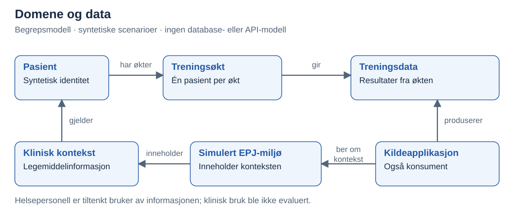
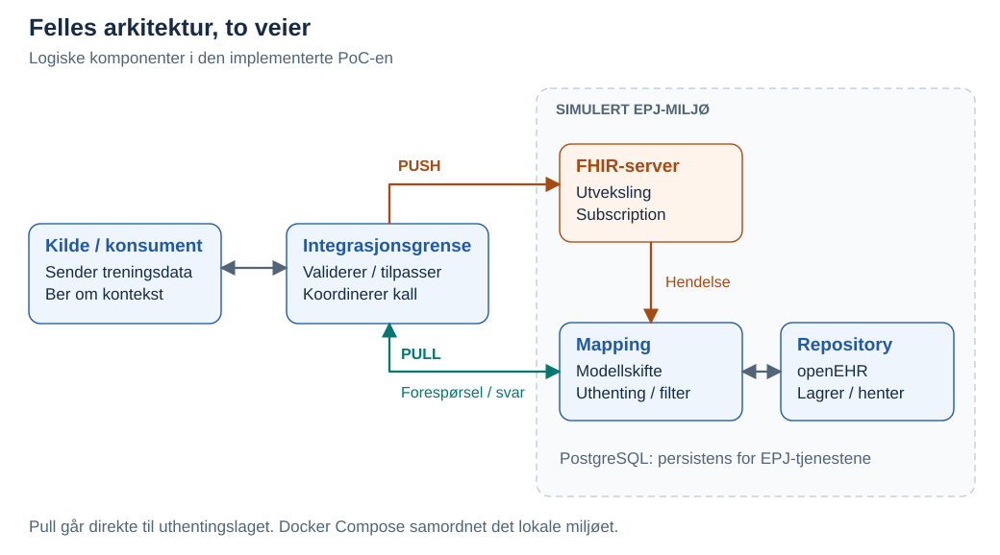
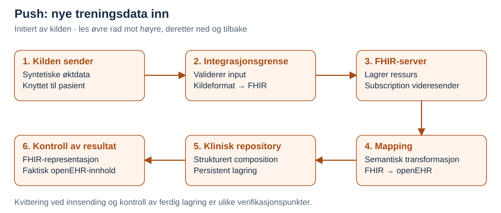
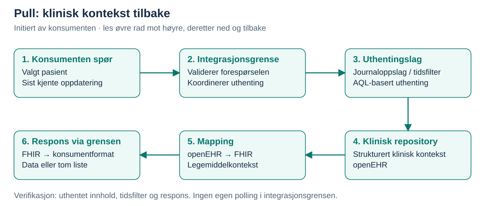
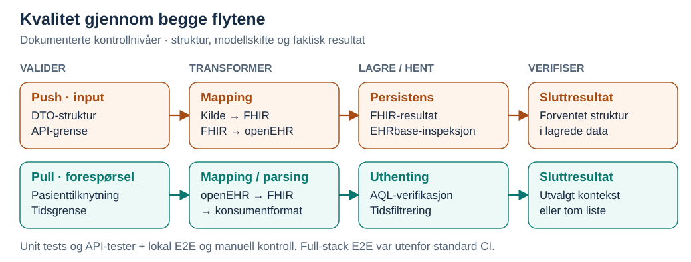

# NVE Case 1 – Fra kildedata til lagring og tilbake

Casepresentasjon av **Usman Ghafoorzai** · Dataingeniør · ca. 11 minutter

I bachelorprosjektet utviklet og verifiserte vi to dataflyter: **treningsdata inn til strukturert lagring**, og **klinisk kontekst tilbake til en konsument**. Arbeidet ble gjennomført av to studenter.

> **Ramme:** Lokal Proof of Concept (PoC), simulert EPJ-miljø og syntetiske data. Resultatet viser teknisk gjennomførbarhet. Produksjonsintegrasjon, klinisk effekt og en ferdig brukerflate inngikk ikke.

**Behov → domene → krav → arkitektur → push og pull → kvalitet → ansvar → designvalg → læring**

## 1. Problem og verdi

En treningsapplikasjon produserer data som kan være relevante for oppfølging. Samtidig kan applikasjonen ha behov for klinisk kontekst fra et annet system. Informasjonen ligger i forskjellige modeller og må få en struktur mottakeren kan bruke.

- **Push-behov:** Gjøre utvalgte treningsresultater tilgjengelige som strukturerte, søkbare data i et klinisk repository.
- **Pull-behov:** Hente relevant legemiddelkontekst tilbake i et enkelt konsumentformat.
- **Verdien av PoC-en:** Redusere teknisk usikkerhet ved å demonstrere begge retninger. Mindre manuell informasjonsinnhenting er en mulig senere gevinst, ikke en målt effekt.

## 2. Domene og data

Modellen viser begreper og relasjoner. Hver økt tilhører én pasient i testscenarioet. Pull var avgrenset til **legemiddelinformasjon**, og denne ble opprettet som syntetiske testdata i EPJ-miljøet. Den var ikke et resultat av push-flyten.

**Modelleringspoeng:** Pasienttilknytning, tidspunkt og betydningen av verdiene må følge informasjonen gjennom representasjonene. Klinisk relevans måtte fortsatt vurderes av domeneeksperter.

## 3. Krav til dataflytene

| Behov | Krav som styrte implementasjonen |
|---|---|
| Data inn | Validere input, transformere og lagre treningsdata strukturert. |
| Kontekst ut | Hente for valgt pasient, filtrere på oppdateringstid og håndtere ingen nye data. |
| Etterprøvbarhet | Kunne kontrollere respons, mapping og lagrede/hentede data. |
| Testbarhet | Modulære komponenter, dokumenterte API-er og et repeterbart lokalt miljø. |

**Avgrensning:** Autentisering og autorisasjon var beskrevet på designnivå. Full OAuth 2.0/OpenID Connect, komplett synkronisering og fullstendig synkroniseringslogging ble ikke implementert.

## 4. Arkitektur og teknologier

| Rolle | Teknologi og bruk i PoC-en |
|---|---|
| Integrasjonsgrense | **NestJS / TypeScript:** inputvalidering, koordinering og konsumentformat. |
| Utveksling | **HL7 FHIR / HAPI FHIR:** ressursrepresentasjon og Subscription i push. |
| Mapping og uthenting | **Java / Spring:** transformasjon mellom FHIR og openEHR; koordinering av pull. |
| Klinisk lagring | **openEHR / EHRbase**, med **PostgreSQL** som persistent lagring for de lokale EPJ-tjenestene. |
| Kjøring og verifikasjon | **Docker Compose**, **Jest**, **GitHub Actions**, **Swagger/OpenAPI** og **AQL**. |

FHIR var utvekslingsmodellen; openEHR var lagringsmodellen. Data ble lagret og hentet gjennom tjenestenes grensesnitt. Docker Compose samordnet det lokale testmiljøet; selve flytene ble styrt av forespørsler og hendelser.

## 5. Implementerte dataflyter

### 5.1 Push – fra kildedata til strukturert lagring

1. **Kilden sender:** En syntetisk pasient opprettes først. Treningsdata sendes med pasienttilknytning gjennom integrasjonsgrensen.
2. **Grensen validerer og transformerer:** Input kontrolleres mot forventet struktur og representeres som en FHIR Observation.
3. **Utvekslingslaget videresender:** FHIR-serveren lagrer ressursen. Subscription varsler mappinglaget om relevante nye data.
4. **Mappinglaget strukturerer:** Informasjonen omformes til en openEHR composition og lagres i det kliniske repositoryet.

**Verifikasjon:** Vi kontrollerte både FHIR-representasjonen og det faktisk lagrede openEHR-innholdet. Kvitteringen fra første API-kall var ikke alene bevis på at hele den hendelsesdrevne kjeden var fullført.

### 5.2 Pull – fra klinisk kontekst til konsument

1. **Konsumenten spør:** Forespørselen angir pasient og sist kjente oppdateringstid. Integrasjonsgrensen validerer forespørselen.
2. **Uthentingslaget finner data:** Pasienten knyttes til riktig journal i testmiljøet. AQL brukes til å hente strukturert legemiddelkontekst med tidsfiltrering.
3. **To representasjonsskifter:** openEHR-data omformes til FHIR MedicationRequest i en samlerespons, deretter til et enklere konsumentformat.
4. **Grensen returnerer:** Relevante oppdateringer kommer tilbake; uten nyere data returneres en tom liste.

**Verifikasjon:** Vi kontrollerte uthenting fra repositoryet, transformert respons og oppførsel med ulike tidsgrenser. Konsumentsiden hadde ansvar for når den spurte; integrasjonsgrensen hadde ingen egen periodisk polling eller varig lagring av pasientkoblinger.

### 5.3 Hvorfor flytene er forskjellige

| | Push | Pull |
|---|---|---|
| Trigger og ansvar | Kilden har en ny økt og sender. | Konsumenten trenger kontekst og spør. |
| Dataretning | Treningsdata → klinisk lagring. | Klinisk kontekst → konsument. |
| Transformasjon | Kildeformat → FHIR → openEHR. | openEHR → FHIR → konsumentformat. |
| Mekanisme | Innsending, deretter Subscription. | Eksplisitt request/response og filtrert uthenting. |
| Kontrollpunkt | Riktig struktur faktisk persistert. | Riktig utvalg og respons, også uten nye data. |

Den valgte Subscription-mekanismen reagerte på ressursendringer, ikke på en GET-forespørsel. Pull måtte derfor få en egen uthentingsvei. Konsekvensen for standardkompatibilitet kommer i del 8.

## 6. Datakvalitet og verifisering

**Kvalitet ble kontrollert på flere nivåer:**

- **Input og struktur:** DTO-validering og tester av API-grensen, inkludert controller- og klientoppførsel.
- **Transformasjon:** Unit tests av mapping, parsing og tjenestelogikk. Kontrollen gjaldt også hvordan data ble representert etter modellskiftet.
- **Push gjennom systemet:** Lokale E2E-tester kontrollerte utvalgt API-oppførsel og FHIR-resultat. Separat inspeksjon i EHRbase bekreftet strukturert persistens.
- **Pull gjennom systemet:** AQL-verifikasjon av syntetisk kontekst, lokale E2E-tester og manuelle API-kontroller av uthenting, tidsfiltrering og respons.

**Sporbarhet:** Identifikatorer, API-responser og lagret/hentet innhold gjorde det mulig å følge testdata gjennom kjeden. Dette var teknisk verifikasjon av utvalgte scenarioer; modellene var ikke klinisk validert.

## 7. Ansvar, eierskap og kontrakter

| Grense | Ansvar i PoC-en | Teknisk kontrakt |
|---|---|---|
| Kilde/konsument ↔ integrasjon | Innsending eller forespørsel utenfra; validering og tilpasning ved grensen. Varig identitetskobling og tidspunkt for uthenting lå utenfor integrasjonsgrensen. | Dokumenterte API-/DTO-strukturer. |
| Integrasjon ↔ utveksling/mapping | Push videresendes via FHIR-serveren; pull koordineres direkte mot uthentingslaget. | FHIR-representasjoner; tilpasset FHIR-orientert pull-grensesnitt. |
| Mapping ↔ repository | Semantisk transformasjon, strukturert persistens og uthenting. | openEHR-strukturer og repositoryets grensesnitt. |

Vi hadde komponentansvar og tekniske kontrakter. **Formelt dataeierskap og driftsansvar var ikke etablert som i et produksjonsdataprodukt.** Der ville jeg formalisert eiere, versjonerte kontrakter, kvalitetskrav, endringshåndtering og ansvar ved feil.

## 8. Utfordring og designvalg

**Problem:** Den opprinnelige arkitekturen la opp til samme FHIR-lag i begge retninger, men videresending av nye data og uthenting krevde ulike mekanismer.

**Alternativer:** Vi vurderte å endre FHIR-serverens interne oppførsel. Det ville økt kompleksiteten og omfanget. For push kunne vi bruke eksisterende Subscription-støtte.

**Beslutning:** Beholde hendelsesdrevet push og la pull gå direkte til mapping- og uthentingslaget.

**Trade-off:** Begge flyter kunne implementeres og verifiseres lokalt, men pull ble et **tilpasset, FHIR-orientert grensesnitt**, ikke et fullt standardkompatibelt FHIR-søk. FHIR-serverens innebygde søke- og valideringsfunksjoner fulgte ikke automatisk med denne veien.

**Læring:** Verifiser hver retning før arkitekturen låses. En felles representasjon betyr ikke at samme transportmekanisme dekker alle behov.

## 9. Utviklingsflyt og CI/CD

**Avgrenset endring → Pull Request → automatiserte tester og byggkontroller → merge/integrasjon**

Kodeansvaret var delt i API-håndtering, tjenester, klienter og mapping, med tester rundt disse grensene. Arbeidsflyten ble strammet inn underveis med tydeligere endringer og CI-kontroller.

GitHub Actions kjørte tester og bygg/verifikasjon. **Full Docker-basert E2E var utenfor standard CI**, fordi testene krevde kjørende tjenester og klargjorte testdata. Derfor supplerte vi med lokal og manuell verifikasjon. Dette var CI frem mot integrasjon, ikke en automatisert produksjonsleveranse.

## 10. Læring og videre arbeid

Jeg ville prioritert tre forbedringer:

1. **Standardisere pull:** Undersøke en standardtilpasset uthentingsvei gjennom et FHIR-lag, med tydelige versjonerte kontrakter.
2. **Styrke kvalitet og drift:** Automatisere et repeterbart E2E-miljø i CI, definere kvalitetskrav og forbedre overvåking og feilsporing.
3. **Validere for neste miljø:** Fullføre tilgangskontroll, få modellene vurdert av domeneeksperter og teste mot mer produksjonsnær infrastruktur.

## Avslutning

- **Forstå dataenes betydning før modellene kobles sammen.**
- **Plasser ansvar ved tydelige systemgrenser.**
- **Verifiser det konsumenten faktisk får – og det som faktisk blir lagret.**

---

[Presentasjonsnotater og tidsplan](docs/presentasjonsnotater.md) · [Publiseringsgrense](docs/publiseringsgrense.md)
