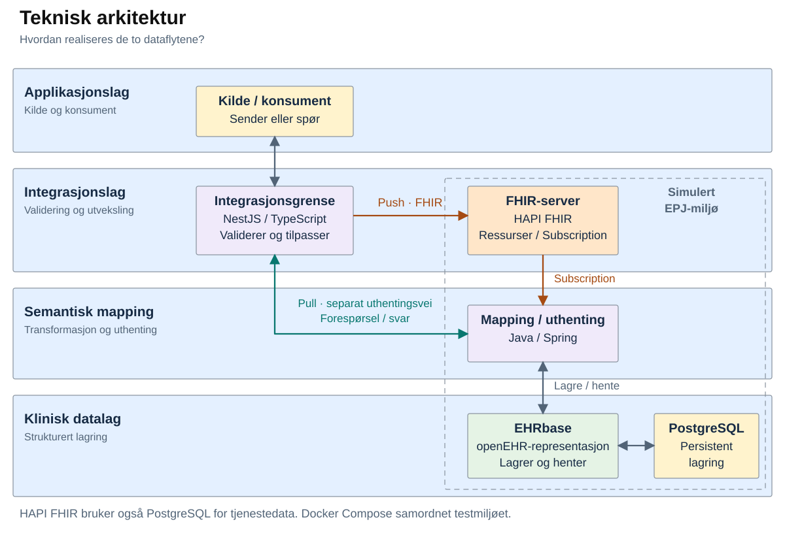
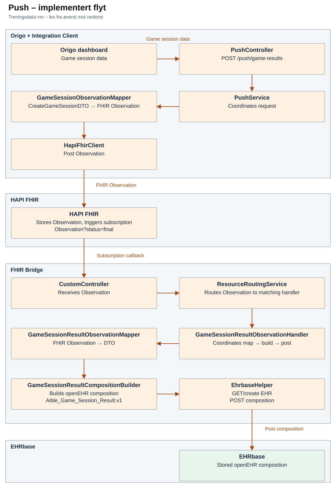
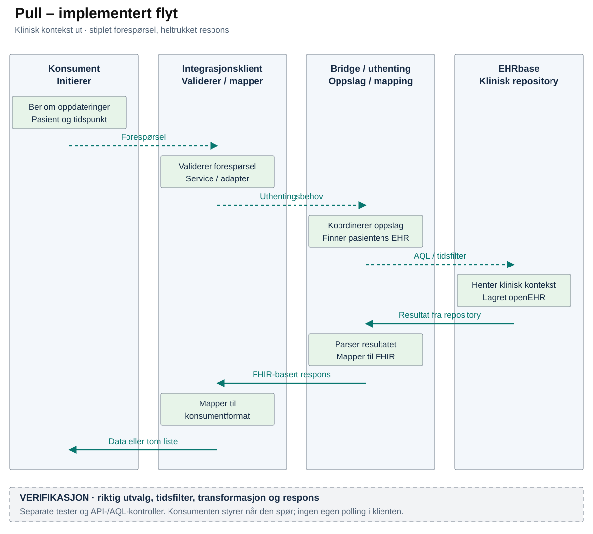
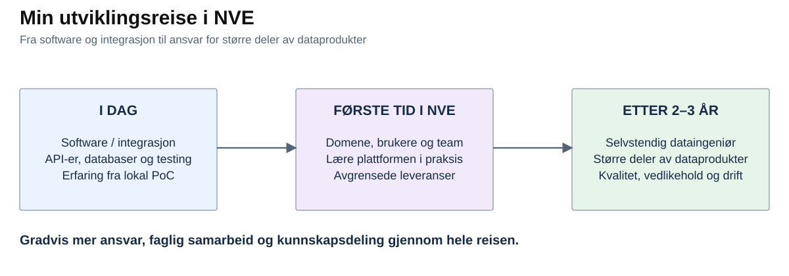
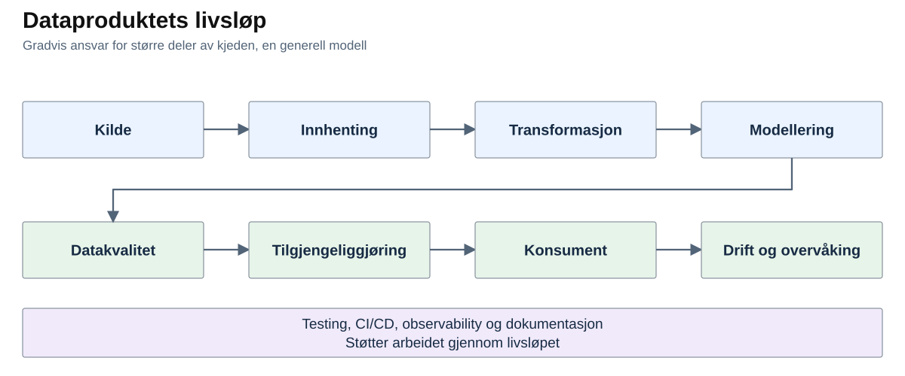
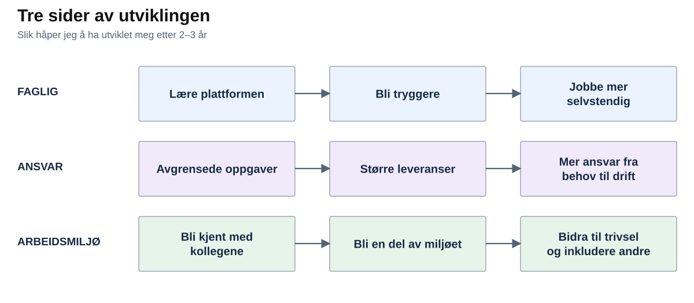

# NVE – Casepresentasjon

**2. gangsintervju – Usman Ghafoorzai**

## Case 1 – Strukturert datautveksling i to retninger

Jeg har valgt å ta utgangspunkt i bachelorprosjektet mitt, der vi jobbet med et ganske konkret problem: **Hvordan får vi data fra en ekstern helseteknologi inn i systemene helsepersonell faktisk bruker, og hvordan får vi relevant klinisk informasjon tilbake?**

Løsningen vi bygde var én integrasjonsløsning med to komplementære dataflyter: treningsdata inn til strukturert lagring og klinisk kontekst tilbake til konsumenten.

Vi var to studenter på prosjektet, og arbeidsformen vår var lagt opp slik at begge jobbet på tvers av hele løsningen. Så det jeg viser her er arbeid jeg selv har vært med på å utvikle, teste og dokumentere.

> **Ramme:** Dette var en lokal Proof of Concept med syntetiske data og et simulert EPJ-miljø. Målet var å undersøke om løsningen var teknisk gjennomførbar, ikke å bygge en produksjonsklar helseintegrasjon.

### 1. Hvilket problem skulle vi løse, og hvilken verdi kunne løsningen gi?

Digitale helseteknologier kan samle inn nyttige data uten at informasjonen automatisk blir tilgjengelig i systemene der den skal brukes. Ulike systemer bruker forskjellige representasjoner og har ulike krav til struktur, pasienttilknytning og betydning. Resultatet kan bli informasjonssiloer og manuelle overføringer.

Det var også utgangspunktet for prosjektet vårt. Aible har treningsplattformen Origo, som kan samle inn data fra treningen til pasienten fra en ekstern applikasjon. Hvis disse dataene bare blir liggende i Origo, er de ikke nødvendigvis tilgjengelige der helsepersonell faktisk jobber.

I problembildet vårt var **Velferdsteknologisk knutepunkt (VKP)** et eksempel på et mellomledd mellom velferdsteknologi og elektroniske pasientjournal-systemer. Utfordringen vi ønsket å se nærmere på var at informasjonsflyten fortsatt kan bli fragmentert når relevante data ligger utenfor den kliniske arbeidsflaten og må hentes eller overføres mellom systemer.

Derfor undersøkte vi om vi kunne få til en mer direkte og strukturert utveksling mellom Origo og et simulert-EPJ-miljø:

- **Push:** Kan treningsdata sendes fra Origo, valideres og transformeres til riktig struktur før de lagres på EPJ-siden?
- **Pull:** Kan Origo be om relevant klinisk kontekst og få tilbake det den trenger?

**Verdien vi faktisk demonstrerte** var: vi viste at data kunne valideres, transformeres, lagres, hentes og verifiseres gjennom flyten.

**Den potensielle virksomhetsverdien** er at informasjon fra separate systemer kan bli tilgjengelig der den trengs, og føre til mindre behov for manuell innhenting og overføring. PoC-en vår målte ikke kliniske eller økonomiske gevinster.

### 2. Hva bygde vi løsningen med?

| Område | Teknologi og rolle |
|---|---|
| Integrasjonsklient | **NestJS / TypeScript:** tok imot forespørsler, validerte input, koordinerte flyten og tilpasset data mellom systemgrensene. |
| Utveksling | **FHIR:** representasjon for strukturert utveksling. **HAPI FHIR:** FHIR-server og Subscription-mekanisme i push-flyten. |
| Bridge og mapping | **Java / Spring:** routing, transformasjon, EHR-oppslag og koordinering av lagring og uthenting. |
| Klinisk struktur | **openEHR og template:** strukturen dataene skulle ha ved klinisk persistens. |
| Lagring | **EHRbase:** openEHR-tjeneste. **PostgreSQL:** underliggende persistens for EHRbase og HAPI FHIR. |
| Uthenting | **AQL:** brukt til å hente kliniske data fra EHRbase i pull-flyten. |
| Miljø og testing | **Docker Compose, Jest, API-kontroller og lokale E2E-tester.** |
| CI | **GitHub Actions:** automatiserte tester og byggkontroller. |

Teknologiene gir mer mening når vi ser dem i selve dataflyten.

### 3. Hvordan gikk dataene gjennom løsningen?

På overordnet nivå hadde vi de samme sentrale systemene, men push og pull løste to forskjellige behov. Derfor endte de også med forskjellige tekniske mekanismer.

#### Push – treningsdata inn

I push var den syntetiske pasienten registrert først. Når en treningsøkt skulle sendes inn, tok Integration Client imot dataene, validerte dem og mappet dem til en **FHIR Observation**.

Observation ble sendt til **HAPI FHIR**, som lagret ressursen. En konfigurert **Subscription** reagerte på relevante nye Observations og sendte dem videre til **FHIR Bridge**.

Bridge-laget tok over derfra: det routet innholdet til riktig behandling, mappet fra FHIR til forventet **openEHR-struktur**, fant riktig EHR og lagret resultatet gjennom **EHRbase**.

**Kort fortalt:**

**Game session-data → FHIR Observation → HAPI FHIR → Subscription → FHIR Bridge → openEHR composition → EHRbase**

#### Pull – klinisk kontekst tilbake

Pull startet motsatt: her var det konsumenten som hadde et behov og spurte etter oppdatert klinisk kontekst for en pasient.

Integration Client validerte forespørselen og sendte den videre til FHIR Bridge. Bridge fant riktig EHR og brukte **AQL** med tidsfilter mot EHRbase.

Resultatet fra AQL ble parset og mappet til **FHIR MedicationRequest**-ressurser. Disse ble sendt tilbake i en FHIR-basert respons, før Integration Client tilpasset resultatet til formatet konsumenten trengte. Hvis det ikke fantes nyere data, fikk konsumenten en tom respons.

**Kort fortalt:**

**Konsument → Integration Client → FHIR Bridge → AQL/EHRbase → FHIR-basert respons → konsumentformat**

Det viktige skillet er at **HAPI FHIR ikke var med i den implementerte pull-flyten**. Push var hendelsesdrevet gjennom Subscription, mens pull var forespørselsstyrt.

### 4. Hvordan visste vi at dataene faktisk ble riktige?

Vi prøvde å kontrollere dataene flere steder i flyten, ikke bare ved første API-kall.

- **Ved inngangen** brukte vi DTO-validering for å sjekke at input hadde forventet struktur.
- **I mappingen** brukte vi enhetstester med Jest for å kontrollere transformasjon og logikk.
- **Ved lagring** brukte vi openEHR-templaten som forventet målstruktur, og kontrollerte i EHRbase hva som faktisk var blitt lagret.
- **I pull-flyten** brukte vi AQL-verifikasjon, lokale E2E-tester og API-kontroller for å sjekke uthenting, tidsfiltrering, transformasjon og tom respons.

Det viktigste poenget for meg er egentlig ganske enkelt:

**En `200 OK` ved inngangen betyr ikke at hele dataflyten er riktig.**

Derfor kontrollerte vi både det som faktisk ble lagret og det konsumenten faktisk fikk tilbake.

### 5. Hvem hadde ansvar for hva?

Kildeapplikasjonen var opprinnelsen til treningsdataene, mens EPJ-miljøet var kilden til den kliniske konteksten. Integration Client skulle ikke bli enda en klinisk datakilde. Jobben dens var å validere, transformere og formidle mellom systemene.

Vi hadde tydelige tekniske grenser gjennom **DTO/API, FHIR og openEHR**, og komponentene hadde forskjellige ansvar.

Det vi ikke hadde i denne PoC-en var et formalisert dataeierskap, SLA-er, driftsansvar og fullverdige datakontrakter slik jeg ville forventet i et produksjonsdataprodukt.

Hvis løsningen skulle i produksjon, ville jeg vært mye tydeligere på hvem som eier hvilke data, hvordan kontrakter versjoneres, hvilke kvalitetskrav som gjelder og hvem som har ansvar når noe feiler eller endres.

### 6. Hva var det vanskeligste?

Den største arkitekturutfordringen kom egentlig av at vi først ønsket å bruke **HAPI FHIR i begge retninger**.

Det fungerte godt i push. Når en ny relevant Observation kom inn, kunne Subscription-mekanismen reagere og sende den videre.

Pull var annerledes. Der var behovet at konsumenten aktivt skulle kunne spørre: **Har det kommet ny klinisk informasjon for denne pasienten siden sist?**

Subscription løser ikke det problemet. Vi vurderte å endre FHIR-serverens interne oppførsel, men det ville gjort løsningen større og mer komplisert enn nødvendig for PoC-en.

Derfor beholdt vi **Subscription for push**, men lagde en egen forespørselsstyrt uthentingsvei for pull.

Trade-offen var at pull fungerte og kunne verifiseres, men den ble ikke et fullt standardkompatibelt FHIR-søk.

Det viktigste jeg lærte av akkurat dette var at **selv om to dataflyter bruker samme representasjon, betyr ikke det at de bør bruke samme transportmekanisme**.

### 7. Hva lærte jeg, og hva ville jeg gjort videre?

Det jeg sitter mest igjen med er hvor viktig det er å forstå **hva dataene faktisk betyr**, ikke bare hvordan man flytter dem fra A til B.

Jeg lærte også hvor mye ansvar som ligger i mapping mellom systemer. Det holder ikke at et API svarer OK hvis informasjonen har mistet betydning underveis eller aldri havner riktig hos mottakeren.

Hvis jeg skulle jobbet videre med løsningen, ville jeg særlig sett på:

- bedre standardtilpasning av pull
- mer automatisert E2E-testing
- tydeligere kvalitetskrav og bedre overvåking
- produksjonsklar autentisering og autorisasjon
- mer domene- og klinisk validering
- testing i et mer produksjonsnært miljø

### Valgfritt – hvordan organiserte vi kode og utviklingsflyt?

I Integration Client prøvde vi å holde ansvarene tydelige: **controller/DTO** håndterte API-grensen, **service** koordinerte det som skulle skje, **mapper** oversatte mellom representasjoner og **adapter/client** håndterte kommunikasjonen med eksterne tjenester.

Docker Compose ga oss et repeterbart lokalt miljø, og konfigurasjon ble holdt separat fra forretningslogikken.

Utviklingsflyten var i hovedsak:

**Avgrenset endring → Pull Request → automatiserte tester og byggkontroller → merge**

Vi brukte **GitHub Actions** til de automatiserte kontrollene. Den fulle Docker-baserte E2E-flyten lå ikke i standard CI, så den verifiserte vi lokalt i tillegg.

---

## Case 2 – Etter 2–3 år som dataingeniør i NVE

Hvis vi spoler 2–3 år fram, håper jeg å ha blitt sterkere faglig, fått mer ansvar og blitt en ordentlig del av miljøet i NVE.

### Dette tar jeg med inn

Jeg har software- og integrasjonsbakgrunn med Java, TypeScript, SQL/databaser, API-er og testing. Jeg er vant til å følge data gjennom systemer og feilsøke, men har mye å lære om dataplattform, datamodellering og drift.

### Første tid – lære NVE og bli en del av teamet

Jeg ser for meg å lære dataene, domenet og [plattformen](https://www.nve.no/om-nve/jobb-i-nve/bli-en-del-av-nves-satsing-paa-data-plattform-og-gis/) gjennom avgrensede oppgaver med erfarne kolleger. Jeg bygger videre på SQL og Python og lærer dbt, Azure, Databricks og Airflow i praksis.

Samtidig vil jeg bli kjent med folk, tørre å spørre når jeg ikke vet og ta imot tilbakemeldinger. Jeg vil delta både faglig og sosialt.

### Etter hvert – mer ansvar

Etter hvert håper jeg å kunne følge større deler av en dataflyt helt fram til dem som trenger dataene. Erfaringen med integrasjoner og feilsøking gir meg noe å bygge videre på.

### Etter 2–3 år – tryggere og en del av miljøet

Jeg håper å kunne ta større oppgaver fra behov til løsning og drift, gjøre egne vurderinger og vite når jeg trenger hjelp.

Jeg håper også å kjenne kollegene godt, delta på sosiale ting og bidra til at det er hyggelig å komme på jobb. Da vil jeg gjerne hjelpe nye kolleger inn i miljøet, og være en folk både jobber godt med og trives sammen med.

[NVEs arbeid](https://www.nve.no/om-nve/dette-er-nve/) med energi, vassdrag og naturfare gir dette mening. Jeg vil bidra til data andre kan stole på.
